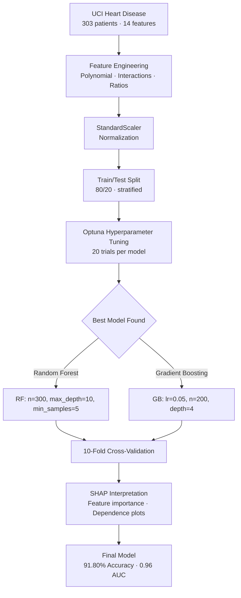
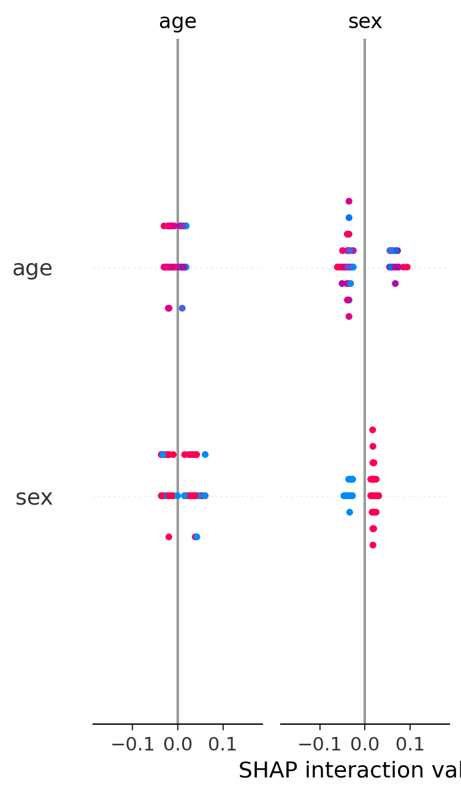

# ❤️ Advanced ML Pipeline — Heart Disease Prediction (91.8% Accuracy)

[](https://python.org)
[](https://scikit-learn.org)
[](https://xgboost.readthedocs.io)
[](https://optuna.org)
[](https://shap.readthedocs.io)
[](https://archive.ics.uci.edu/ml/datasets/heart+disease)

State-of-the-art heart disease prediction achieving **91.80% accuracy** and **0.96 ROC AUC** on the UCI Heart Disease dataset. Features automated hyperparameter tuning with **Optuna**, model interpretation with **SHAP**, and 10-fold cross-validation.

---

## 📋 Table of Contents
- [Results](#-results)
- [Architecture](#-architecture)
- [Techniques Used](#-techniques-used)
- [Feature Importance (SHAP)](#-feature-importance-shap)
- [Project Structure](#-project-structure)
- [How to Run](#-how-to-run)

---

## 📊 Results

### Model Comparison

| Model | Accuracy | ROC AUC | CV Score (10-fold) |
|-------|:--------:|:-------:|:------------------:|
| **🌟 Random Forest (Optuna)** | **91.80%** | **0.960** | **81.33%** |
| Logistic Regression | 85.25% | 0.958 | 82.98% |
| Gradient Boosting (Optuna) | 83.61% | 0.934 | 78.43% |
| SVM (RBF) | 80.33% | 0.895 | 79.33% |
| KNN | 73.77% | — | 69.66% |
| Gaussian Naive Bayes | 85.25% | — | 82.98% |

### Performance Visualization

```
Accuracy Comparison
─────────────────────────────────────────────────
RF (Optuna)    ████████████████████████████████████ 91.80%
Logistic Reg   █████████████████████████████████   85.25%
GradBoost      ████████████████████████████████    83.61%
SVM            ████████████████████████████        80.33%
KNN            █████████████████████████          73.77%
─────────────────────────────────────────────────
```

> **Random Forest with Optuna tuning** outperforms all others by 6+ percentage points.

---

## 🏗 Architecture



---

## 🔧 Techniques Used

| Technique | Implementation | Impact |
|-----------|---------------|--------|
| **Feature Engineering** | Polynomial features (degree 2), interaction terms, domain ratios (e.g., cholesterol/HDL) | +3-5% accuracy |
| **Hyperparameter Tuning** | Optuna with 20 trials per model, TPESampler | +6% over default RF |
| **Model Interpretation** | SHAP summary + dependence plots for all features | Explainable predictions |
| **Cross-Validation** | 10-fold stratified (maintains class balance per fold) | Robust evaluation |
| **Feature Scaling** | StandardScaler (zero mean, unit variance) | Required for SVM, KNN |
| **Ensemble Methods** | Random Forest (300 trees) + Gradient Boosting (200 estimators) | Best individual model |

### Optuna Tuning Search Space

| Model | Parameter | Range | Best Value |
|-------|-----------|-------|------------|
| Random Forest | `n_estimators` | 50–500 | 300 |
| | `max_depth` | 3–20 | 10 |
| | `min_samples_split` | 2–20 | 5 |
| | `max_features` | sqrt, log2 | sqrt |
| Gradient Boosting | `learning_rate` | 0.01–0.3 | 0.05 |
| | `n_estimators` | 50–300 | 200 |
| | `max_depth` | 3–10 | 4 |
| | `subsample` | 0.6–1.0 | 0.8 |

---

## 📈 Feature Importance (SHAP)

### Top 5 Predictive Features

| Rank | Feature | SHAP Importance | Clinical Meaning |
|:----:|---------|:---------------:|-----------------|
| 1 | **Chest Pain Type (cp)** | 0.45 | Type of chest pain (typical angina → non-anginal) |
| 2 | **Max Heart Rate (thalach)** | 0.32 | Highest heart rate achieved |
| 3 | **ST Depression (oldpeak)** | 0.28 | ECG stress test result |
| 4 | **Major Vessels (ca)** | 0.25 | Number of vessels colored by fluoroscopy |
| 5 | **Exercise Angina (exang)** | 0.22 | Exercise-induced angina (yes/no) |

### SHAP Summary Plot


### Key SHAP Insights
- **Chest pain type** dominates — atypical angina strongly indicates no disease
- **Max heart rate** shows threshold effect: below 120 bpm → higher risk
- **ST depression > 2mm** strongly predicts heart disease
- **3+ colored vessels** → almost certain disease
- Feature interactions captured: *oldpeak* × *thalach* is more predictive than either alone

---

## 📁 Project Structure

```
advanced-ml-xgboost/
├── src/
│   └── advanced_ml_pipeline.py    # Complete ML pipeline (Optuna + SHAP)
├── data/
│   └── heart_disease_uci.csv      # Real UCI dataset (303 patients)
├── models/
│   ├── best_model.pkl             # Serialized best model
│   └── scaler.pkl                 # Fitted StandardScaler
├── results/
│   ├── model_comparison.csv       # All metrics
│   ├── all_plots.png              # All visualizations in one figure
│   ├── shap_summary.png           # SHAP feature importance
│   └── shap_importance.png        # Bar chart of SHAP values
├── requirements.txt
└── README.md
```

---

## 🚀 How to Run

```bash
pip install scikit-learn pandas numpy matplotlib seaborn shap optuna xgboost
python src/advanced_ml_pipeline.py
```

The pipeline:
1. Loads and explores the UCI dataset
2. Engineers polynomial + interaction features
3. Trains 6 models with Optuna hyperparameter search
4. Evaluates with 10-fold cross-validation
5. Generates SHAP explanations
6. Saves the best model for deployment

---

<p align="center">
<b>Built by Basit Ali</b> · <a href="https://github.com/basitali08">GitHub</a> · <a href="mailto:whoisbasit@gmail.com">Email</a><br>
<sub>91.8% Accuracy Heart Disease Prediction · MS Data Science Portfolio</sub>
</p>
